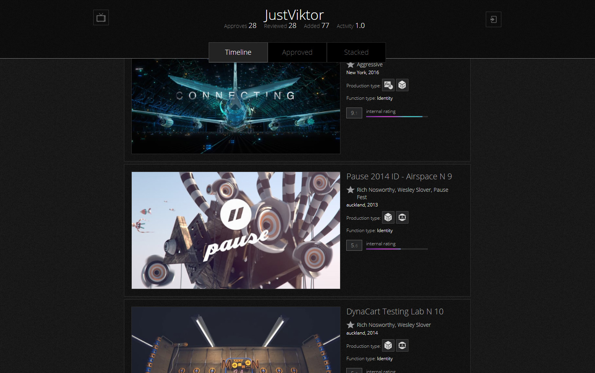

# Television Lab
<a href="http://www.televisionlab.net/" target="_blank">www.televisionlab.net</a> is a prototype of an online motion graphics database.

## Desktop module
Television Lab has main "desktop" interface for searching motion graphics videos in its local database. 
Filtering uses hash-tag #keywords and video production type buttons. 
With main input search field, it is possible to search by year, artist, studio, and misc keywords.

&nbsp;
## Contributor's feed
There is a prototype of personal feed for contribution users, 
which has sections for "Approved", "Stacked", "Review" videos and general "Timeline".

&nbsp;
## Add module
Users can suggest videos (and approve each other) from vimeo.com by "add" module, providing Vimeo video id code. 
"Add" module loads all main fields automatically and asks for new user's keywords.

